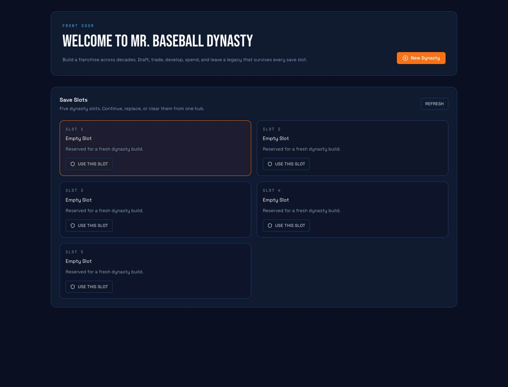
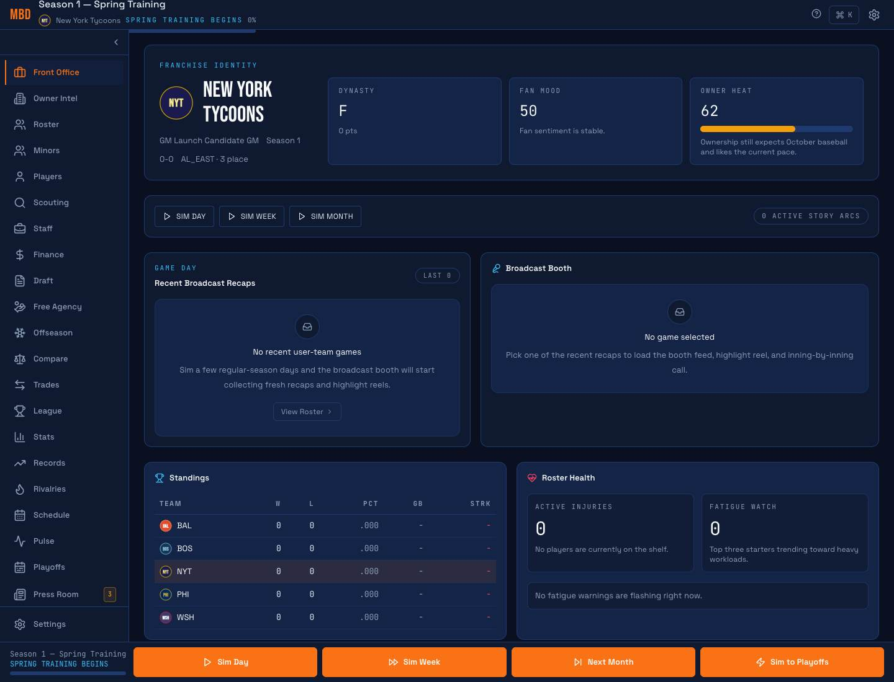
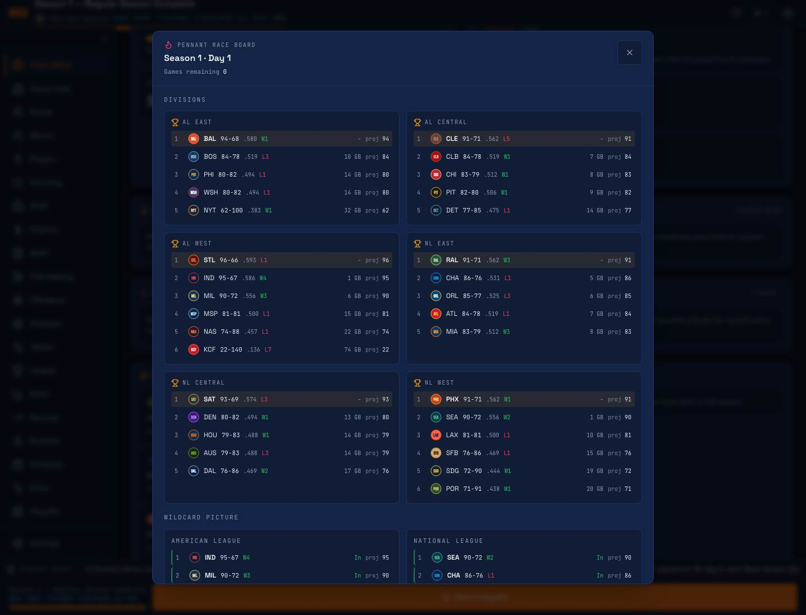
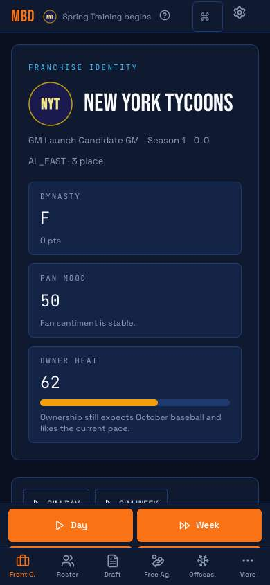

# Mr. Baseball Dynasty

Browser-based baseball franchise dynasty simulation. Build a front office, make baseball decisions, and watch a deterministic league history unfold across seasons.

**Play:** [kevinbigham.github.io/MBD](https://kevinbigham.github.io/MBD/)

## Screenshots









## What It Is

- A single-player franchise sim about roster building, player development, payroll pressure, scouting, trades, drafts, free agency, playoffs, and long-term consequences.
- A deterministic save-driven simulation: the same seed and same decisions produce the same league.
- A dynasty history machine: records, awards, rivalries, story reels, career retrospectives, and franchise memory accumulate over time.
- A local-first browser game using IndexedDB saves and a web-worker sim engine.

## What It Is Not

- Not an MLB-licensed product.
- Not fantasy sports, betting, packs, loot boxes, or pay-to-win.
- Not a twitch game. Most value comes from planning, simming, reading the league, and making tradeoffs.
- Not a finished forever-game. v1.0.0 is the first stable public milestone.

## How To Play

1. Open the live URL.
2. Start a new dynasty from the Save Hub.
3. Pick a club, choose Quick Start or Full Day One, and enter the front office.
4. Advance by day, week, or month.
5. Use the dashboard, roster, minors, draft, trade, finance, scouting, league, history, and press-room views to steer the franchise.
6. Follow the dynasty through seasons: standings, playoff races, player arcs, awards, records, and owner pressure all compound.

## Tech Stack

TypeScript strict mode, React 18, Vite 6, Tailwind CSS, Zustand, Dexie, Comlink web workers, pure-rand, Zod contracts, Vitest, pnpm, and Turbo.

## Contributors

Active code lives in `mr-baseball-dynasty/`.

```bash
npx pnpm install
npx pnpm verify
```

Focused gates used before release:

```bash
cd packages/sim-core && npx pnpm typecheck && npx vitest run
cd ../contracts && npx pnpm typecheck && npx vitest run
cd ../../apps/web && npx pnpm typecheck && npx vitest run && npx vite build
```

Do not touch save schema without a version bump, migration, backwards-compat note, and fixture. Do not use `Math.random()` in sim code.

## License

Private project. All rights reserved.

## Credits

Built by Kevin Bigham with AI-assisted implementation across Codex and Claude Code sessions.
