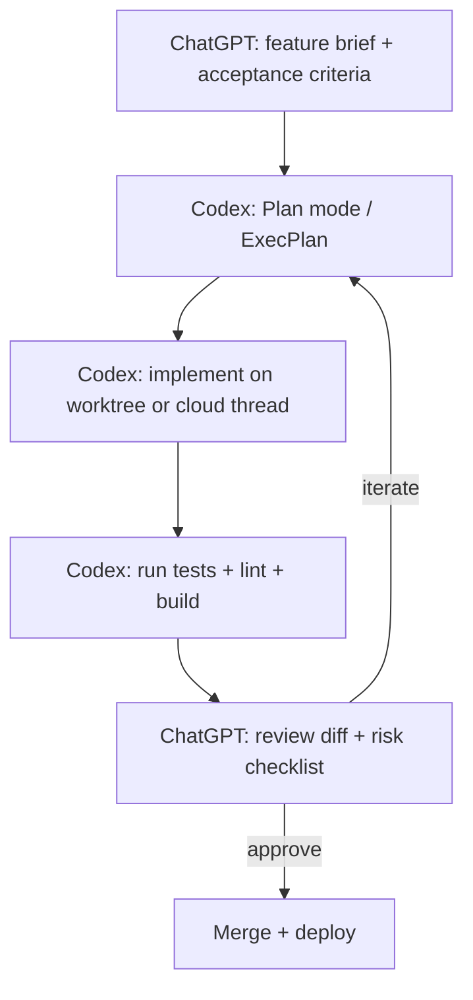
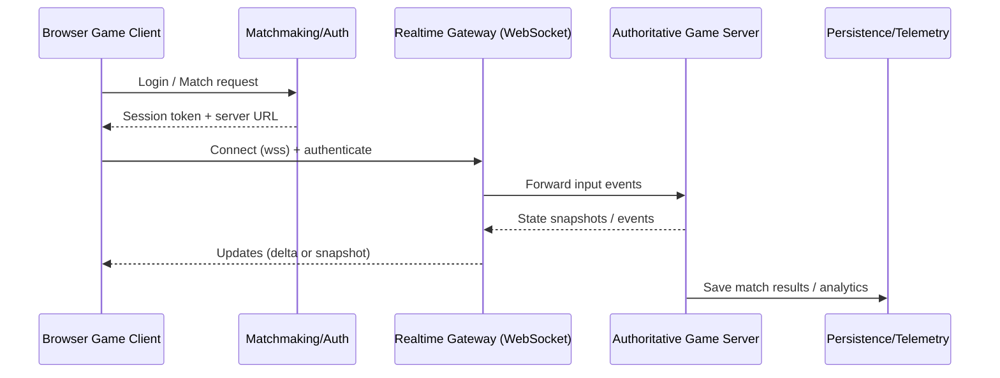

# Codex + ChatGPT Pro Playbook for Shipping Online Games Fast

## Executive summary

This guide describes a high‑leverage collaboration pattern: use ChatGPT (GPT‑5.4 class) as the **director** (design, architecture, acceptance criteria, review) and Codex as the **implementer** (multi‑file edits, running commands, writing tests, creating PRs), with tight feedback loops and strong repo‑resident instructions. citeturn10view1turn20view1turn9view1

Codex is most effective when prompts explicitly define **Goal, Context, Constraints, and “Done when”**—and when it can verify work by running tests/linting and reproducing issues. citeturn20view1turn9view1

For speed and safety, default to **workspace‑scoped sandboxing + approvals**, and deliberately enable network/web search only when needed. Codex’s web search cache reduces (but does not eliminate) prompt‑injection risk from live browsing. citeturn9view2turn21view2

To parallelize game features without merge conflicts, run Codex work in **worktrees** (or cloud threads) and avoid two agent threads editing the same files at once. Git worktrees let you keep multiple checkouts of one repo in parallel. citeturn9view1turn9view4turn6search0

For long, multi‑hour builds (e.g., networking + persistence + deployment), introduce **PLANS.md / ExecPlan** style “living design documents” that Codex follows and continuously updates while it implements and commits. citeturn23view0

## Collaboration model and repo foundations

### Division of labor that scales

A robust mental model is: **ChatGPT = product + architecture + reviewer**, **Codex = engineer + build/test runner**. Codex documentation explicitly frames best results as treating it “like a teammate” you configure over time (via repo guidance, skills, automations), rather than a one‑off assistant. citeturn20view1turn21view0

Codex sessions are “threads” that can be local or cloud; multiple threads can run concurrently, but you should avoid concurrent edits to the same files. citeturn9view1

### “Three files” that unlock consistency

1) **AGENTS.md** (repo instructions): Codex automatically loads agent guidance; the best‑practices guide recommends encoding how to build/run/test/lint and what “done” means into AGENTS.md, and notes `/init` can scaffold a starter file. citeturn20view1turn21view0

2) **.codex/config.toml** (project overrides): Codex supports user and project config layers for durable defaults (model, reasoning effort, sandbox, approvals, MCP servers). citeturn9view3turn10view0turn21view0

3) **PLANS.md / ExecPlan** (long-horizon specs): OpenAI’s ExecPlan cookbook shows a pattern where AGENTS.md instructs when to use planning docs, and PLANS.md defines a self‑contained executable spec format that Codex can follow for hours. citeturn23view0turn20view1

### Minimal AGENTS.md seed (paste-ready)

```md
# AGENTS.md (repo-level)

## Project goal
Build an online game that runs in browsers. Prioritize correctness, testability, and small reviewable diffs.

## How to run
- Web client: (fill in) e.g., `npm install && npm run dev`
- Server: (fill in) e.g., `npm install && npm run start`

## Quality gates (must pass before "done")
- Lint: (fill in) e.g., `npm run lint`
- Unit tests: (fill in) e.g., `npm test`
- E2E smoke: (fill in) e.g., `npm run e2e`

## Coding conventions
- Prefer small, incremental PRs.
- Add tests for new logic; don’t change behavior without updating tests.
- Keep secrets out of the repo; use env vars and CI secrets.

## Definition of done
- Feature works per acceptance criteria.
- Tests + lint pass.
- Performance and security notes updated when relevant.
```

This structure aligns with Codex’s recommended prompt structure and “done when” focus. citeturn20view1turn9view1

### Collaboration workflows overview diagram



Codex supports plan-first approaches (Plan mode; interview-first; PLANS.md templates) to improve outcomes on ambiguous tasks. citeturn20view1turn23view0

## Recommended development workflows

### Project setup workflow

**Core principle:** make “run, test, lint, build, deploy” one-command each, then encode those commands in AGENTS.md so Codex can reliably self‑verify. citeturn20view1turn9view1

A practical baseline setup for browser games is:

- **Client:** Vite-based dev server + build output suitable for static hosting (`vite build` produces a bundle intended to be served statically). citeturn16search10turn16search1  
- **Server (optional multiplayer):** WebSocket service for low‑latency bidirectional updates (or Socket.IO if you want fallback transports and higher-level semantics). citeturn6search2turn12search3turn12search28

For Phaser specifically, an official Phaser + TypeScript + Vite template exists, making it a strong “default” for web-first 2D games. citeturn16search25

### Iteration loop workflow (“tight loop”)

Codex guidance emphasizes breaking complex work into smaller, testable steps, and including validation steps (repro steps, checks, pre-commit). citeturn9view1turn20view1

A fast loop that works well for online games:

1) **ChatGPT writes** a small acceptance test list (observable behaviors), plus edge cases (frame rate drops, reconnects, asset load failures).  
2) **Codex implements** the smallest vertical slice, then runs the repo’s commands (dev server, tests, lints).  
3) **ChatGPT reviews** the diff for architecture drift, security, and performance pitfalls.  
4) Repeat, keeping diffs reviewable.

For browser frame loops, MDN notes `requestAnimationFrame()` is foundational for synchronized game loops and recommends scheduling the next frame early to help the browser plan. citeturn3search2turn3search5

### Testing and debugging workflow

Use layered verification:

- **Unit tests** for deterministic logic (movement math, hit detection, RNG seeding, serialization).  
- **Integration tests** for browser/runtime behavior (asset loading, input mapping, UI state).  
- **E2E smoke** for deployment regressions.

For web stacks, Vitest is designed to align with Vite configuration (unified config), making it a common pairing for Vite-based games; Playwright provides cross-browser end-to-end testing with auto-waiting and web-first assertions. citeturn15search0turn15search12turn15search27

For Unity projects, Unity provides the **Unity Profiler** for performance analysis and recommends profiling on target platforms; WebGL builds have platform-specific memory constraints. citeturn8search1turn17search2turn8search30

For Godot projects, the built-in **Profiler** is off by default because profiling is performance-intensive, and Godot’s docs provide a dedicated performance section. citeturn8search2turn8search31

### Deployment workflow

A clean online-game deploy pattern is “static client + optional realtime backend”:

- Build the client into a static directory and deploy it to a static host (or your own web server). Vite’s `vite build` output is designed for static hosting. citeturn16search10turn16search1  
- Host realtime services on a separate domain/subdomain with TLS and WebSocket support. The WebSocket API enables two‑way interactive sessions without polling. citeturn6search2turn6search10

Engine-specific deployment notes:

- **Godot web exports** rely on WebAssembly and WebGL 2.0; enabling thread support can require cross-origin isolation headers, and Godot’s PWA export can ensure those headers even when the server can’t be configured. citeturn16search0turn17search3turn17search13  
- **Unity WebGL builds** can be compressed (gzip/Brotli). Unity documents tradeoffs (Brotli smaller but slower; and browser/HTTPS considerations). citeturn16search16turn16search2  
- **Unreal Engine for “online in browser”** is commonly delivered via Pixel Streaming (server-rendered frames streamed to browsers), with official deployment docs and an official infrastructure repository. citeturn3search0turn3search3turn3search17

## Prompt-engineering patterns and templates for Codex + ChatGPT collaboration

### The core prompt structure Codex expects

Codex best practices recommend prompts include **Goal, Context (files/errors), Constraints (standards), Done when (verification)**. citeturn20view1turn9view1

**Reusable “Codex Task Prompt” template:**

```md
## TASK: <short title>

### Goal
<What should change? What new capability exists afterward?>

### Context
- Relevant files: <paths>
- Related docs/specs: <paths>
- Errors / logs to reproduce: <paste>

### Constraints
- Keep diff small and reviewable.
- Follow repo conventions in AGENTS.md.
- No breaking API changes without updating callers.
- Security: no secrets in code; validate inputs; avoid eval/dynamic code loading.

### Done when
- Commands pass:
  - <lint command>
  - <unit test command>
  - <build command>
- Manual checks:
  - <steps to reproduce and expected result>
- Performance budget:
  - Target <fps> on <device class>; no new allocations in hot loop.

### Output format
- Summarize approach.
- List files changed.
- Provide exact commands run and results.
- If unsure, stop and ask clarifying questions before writing code.
```

This aligns with Codex’s prompting guidance and its emphasis on verifiable work. citeturn9view1turn20view1

### Plan-first patterns that prevent thrash

Codex best practices describe three planning patterns: Plan mode, interview-first, and PLANS.md execution plans (for multi-hour work). citeturn20view1turn23view0

**Pattern: “Interview me before coding”**

```md
Before writing code, ask me 10–15 questions to clarify:
- core gameplay loop
- target platform (web/mobile/desktop)
- multiplayer architecture (authoritative server? lockstep? casual?)
- performance targets
- asset pipeline and licensing constraints
Then propose 2 architectures and recommend one with tradeoffs.
Only after I answer, start implementation.
```

Codex explicitly recommends asking it to interview you when the idea is fuzzy and to challenge assumptions. citeturn20view1

**Pattern: “ExecPlan for multi-hour builds”**

OpenAI’s ExecPlan/PLANS.md guidance describes a “living document” that must be self-contained, defines milestones, requires proof via test commands, logs decisions, and stays up-to-date as implementation proceeds. citeturn23view0

Use this when implementing large systems (networking, persistence, cross-platform export, CI/CD automation).

### Model and reasoning selection (practical guidance)

OpenAI’s Codex model page recommends starting with **gpt-5.4** for most tasks and notes a fast iteration model in research preview for ChatGPT Pro subscribers. citeturn10view1  
The Codex prompting guide recommends “medium” reasoning effort as a strong default and suggests higher effort for harder tasks. citeturn9view0  
Model availability and defaults can vary by surface and over time; OpenAI’s help center explicitly notes this separation between ChatGPT and Codex availability. citeturn11view3turn11view2

**Operational rule of thumb:**

- Use “fast” models for: scaffolding, small refactors, converting pseudocode to code, quick bug fixes. citeturn10view1turn9view0  
- Use stronger / higher reasoning for: networking correctness, deterministic simulation, security-sensitive code paths, multi-file architectural refactors. citeturn9view0turn20view1

### Prompts for collaboration autonomy and safety

Codex runs locally with sandbox and approval settings; network access is off by default in the workspace-write sandbox unless enabled in config. Web search can run in cached mode to reduce exposure to prompt injection. citeturn9view2turn9view3

**Safe-by-default execution directive:**

```md
Run in sandbox workspace-write with on-request approvals.
Do not request full access unless necessary.
If you need network (npm installs, docs), ask first and justify why.
```

This matches Codex’s documented defaults and risk guidance. citeturn9view2turn19view3

## Code-generation strategies for game projects

### Strategy: scaffold → vertical slice → harden → refactor

Codex performs better when work is broken into small focused steps that are easier to test and review. citeturn9view1turn20view1

A reliable sequence for online games:

1) **Scaffold the runnable app** (menu → start game → pause → game over).  
2) **Make the core loop deterministic** (seeded RNG, fixed timestep simulation if networking).  
3) **Add one feature at a time**, with a test or debug overlay.  
4) **Refactor after behavior is locked** (extract systems: input, physics, rendering, net, UI).  
5) **Optimize only after profiling** (Unity and Godot docs both emphasize profiler-driven workflows; browser Canvas also has dedicated optimization guidance). citeturn8search1turn8search2turn3search15

### Multi-file generation tactics that reduce merge pain

**Use worktrees for parallel feature threads.** The Codex app supports worktrees so multiple tasks don’t interfere, and it explains that worktrees rely on Git worktrees under the hood. citeturn9view4turn6search0turn10view3

**Avoid two threads editing the same files.** Codex explicitly warns against concurrent modifications to the same files across threads. citeturn9view1

**Checkpoint early and often.** OpenAI recommends Git checkpoints before/after tasks to revert easily. citeturn20view0

### Turning repeat work into reusable “skills” (preferred over custom prompts)

OpenAI’s Codex customization docs describe **Skills** as reusable workflows (SKILL.md + scripts/references/assets) that are loaded and visible to the agent; custom prompts are deprecated in favor of skills. citeturn21view0turn21view1

A “game feature skill” pattern that works well:

- `skills/feature-movement/SKILL.md` contains architecture and acceptance checks.  
- `skills/feature-movement/scripts/` can run formatting/tests or generate input mappings.  
- Pair with MCP when the workflow needs external systems. citeturn21view0turn19view2

### Automation and CI-driven refactoring

Codex can be run non-interactively via `codex exec`, including within GitHub Actions; OpenAI provides a Codex GitHub Action (`openai/codex-action@v1`) and a cookbook to auto-fix CI failures. citeturn19view0turn19view1turn22view2

This is especially effective for:

- formatting passes,  
- dependency upgrades,  
- repetitive refactors,  
- failing-test fixes after library updates. citeturn19view1turn19view0

## Engine and web-stack integration guidance

### Quick comparison table for online games

| Stack | Best-fit online game type | Browser delivery strategy | Networking “default” | Key gotchas |
|---|---|---|---|---|
| Phaser (HTML5) | Web-first 2D arcade, platformers, party games | Native Canvas/WebGL via browser | WebSocket / Socket.IO, authoritative server common | Ensure rAF loop discipline and Canvas optimizations for perf citeturn3search2turn3search15turn6search2turn12search6 |
| Unity | 2.5D/3D web builds, richer tooling, larger teams | Unity WebGL build + host assets | Unity Netcode for GameObjects + Unity Transport (or custom) | WebGL memory constraints; profile and tune heap/growth citeturn12search4turn12search1turn17search2turn17search29 |
| Godot | Indie-friendly 2D/3D, open toolchain | WebAssembly + WebGL 2 export | Built-in WebSocket support and HL multiplayer compatibility | Thread support may require cross-origin isolation; PWA option can inject headers citeturn16search0turn2search31turn17search3turn17search13 |
| Unreal | High-fidelity 3D, enterprise visuals | Pixel Streaming to browsers (server-rendered) | Unreal replication + Online Subsystem typically (not browser-native) | Browser play usually means streaming infra (cost/ops), not client-side WebGL citeturn3search0turn3search20turn3search4 |

### Engine-specific considerations (what to tell Codex up front)

**Phaser / HTML5**

- Phaser scenes rely on `preload`/`create` lifecycle and the loader is responsible for external assets (images, atlases, audio, JSON). citeturn13search2turn8search3  
- Use `requestAnimationFrame()` loops correctly; for Canvas performance, MDN provides specific optimization guidance (batch draws, avoid per-frame allocations, cache). citeturn3search2turn3search15  
- For deployment, Vite provides explicit static deployment guidance; Phaser officially promotes a Vite + TS template. citeturn16search1turn16search25

**Unity**

- WebGL builds have constrained and variable browser memory; Unity documents that build output includes a `.data` file unpacked into a virtual filesystem in browser memory. citeturn17search2turn17search19  
- For multiplayer, Unity provides Netcode for GameObjects as a high-level solution and Unity Transport as a low-level networking layer geared toward multiplayer game development. citeturn12search4turn12search1  
- Profiling should use the Unity Profiler and ideally target devices/builds, not only the editor. citeturn8search1turn8search30

**Godot**

- Web export requires WebAssembly + WebGL 2.0, and advanced features like thread support can require cross-origin isolation headers; Godot’s PWA export can ensure headers by using a service worker. citeturn16search0turn17search3turn17search13  
- Character movement guidance: use `CharacterBody2D` and move using `move_and_slide()` / `move_and_collide()` (don’t set position directly), and handle physics motion in `_physics_process()`. citeturn13search4turn13search0  
- WebSocket is implemented via `WebSocketPeer` and is compatible with Godot’s high-level multiplayer. citeturn2search31

**Unreal**

- Unreal’s official Pixel Streaming docs cover deploying interactive browser access by streaming rendered output. citeturn3search0turn3search3  
- Networking for multiplayer uses replication and RPC concepts in Unreal’s networking overview. citeturn3search20

### Web architecture diagram for online play



This reflects the core capability of WebSockets as bidirectional communication without polling. citeturn6search2turn6search10

## Debugging, validation, automation, security, licensing, performance, and reusable snippets

### Automation shortcuts and workflow accelerators

**Codex CLI and app ergonomics**

Codex offers built-in workflow shortcuts: slash commands, a prompt editor (`Ctrl+G` to open `$VISUAL`/`$EDITOR`), `@` file path autocomplete, and shell command prefixing (`!cmd`) under approvals/sandbox. citeturn21view3turn20view0

**Worktrees + parallelism**

Codex worktrees isolate changes for parallel tasks, with a “handoff” flow between worktree and local checkout; Git worktrees enable multiple branches checked out at once. citeturn9view4turn6search0turn9view1

**Rules + least privilege**

Rules can control which commands run outside the sandbox and are treated as experimental; the rules system includes match/not_match examples as “inline unit tests.” citeturn21view2turn9view2

**GitHub automation using Codex**

OpenAI’s Codex GitHub Action runs in workflows to apply patches or post reviews; it requires storing the OpenAI key as a GitHub secret. citeturn19view0turn17search0  
OpenAI also provides a cookbook that embeds Codex into CI to propose fixes when builds/tests fail. citeturn19view1

### Debugging and validation techniques (practical stack defaults)

**JavaScript / Phaser**

- Lint: ESLint (static analysis to find problems; common CI integration). citeturn7search0turn7search4  
- Format: Prettier (opinionated formatter that reprints code consistently). citeturn7search1turn7search13  
- Unit tests: Vitest (Vite-aligned config); or Jest. citeturn15search0turn15search1  
- E2E smoke: Playwright (auto-waiting reduces flakiness). citeturn15search12turn15search27  
- Performance: follow MDN Canvas optimization guidance; avoid per-frame allocations in the hot path. citeturn3search15turn3search2

**Unity / C#**

- Formatting/static analysis: `dotnet format` applies style and analyzer recommendations, and Microsoft warns it may restore/compile and run analyzers—use on trusted code. citeturn7search2  
- Performance: Unity Profiler for CPU/memory/render profiling; Unity also provides profiling workflow guidance stressing early and frequent profiling. citeturn8search1turn8search30  
- Web builds: be explicit about WebGL memory limits and tune heap growth. citeturn17search29turn17search2

**Godot / GDScript**

- Type safety: Godot supports static typing in GDScript to help avoid bugs and improve editor experience. citeturn7search3turn7search19  
- Profiling: Godot’s profiler is performance-intensive and off by default; use it intentionally. citeturn8search2

### Security guidance for online games (especially multiplayer)

**Baseline web app risks still apply.** Use OWASP Top 10 as a standard awareness document for web app security (injection, broken access control, vulnerable components, etc.). citeturn6search3turn6search7

**Prefer CSP on the game page.** The `Content-Security-Policy` header lets you control which resources can load and helps guard against XSS; OWASP’s CSP cheat sheet frames it as defense-in-depth. citeturn17search1turn17search14

**Secrets management**

- Store secrets as GitHub Actions secrets (explicitly injected into workflows); GitHub documents that Actions can only read a secret if you include it in a workflow. citeturn17search0turn17search4  
- Never push API keys or private server URLs to public repos.

**Codex operational security**

Codex sandboxing and approvals exist to reduce risk when agents run commands and edit files; network/web search can increase risk, and cached search reduces exposure to prompt injection compared with live browsing. citeturn9view2turn21view2

### Licensing and IP considerations (code + assets + AI outputs)

**OpenAI outputs and ownership**

OpenAI’s Terms of Use state that, as between you and OpenAI (where permitted by law), you retain ownership in input and own the output, with OpenAI assigning its interest in output to you. citeturn5search0turn5search11  
OpenAI’s help center also states OpenAI will not claim copyright over API-generated content, and points users back to Terms of Use. citeturn5search4turn5search0

**But copyrightability may depend on jurisdiction and human authorship.** The U.S. Copyright Office has emphasized human authorship requirements and concluded AI outputs are protectable only where sufficient human expressive contribution exists. citeturn18search31turn18search11

**Asset licensing**

If you ship third-party art/audio, follow the license terms precisely. Creative Commons BY 4.0 requires attribution (credit, license link, note changes), and Creative Commons recommends attribution components (TASL: Title, Author, Source, License). citeturn18search2turn18search6turn18search10

**Project licensing**

Choose an open-source license deliberately; ChooseALicense provides non-judgmental guidance and highlights that open-source licenses grant permission subject to conditions. SPDX provides standardized license identifiers. citeturn18search0turn18search4turn18search1

### Performance optimization for generated code

**Browser games**

- Use `requestAnimationFrame()` for the main loop and treat frame scheduling as part of performance. citeturn3search2turn3search5  
- Apply Canvas optimization techniques (MDN documents concrete tactics). citeturn3search15  
- Prefer data-oriented structures in hot loops (typed arrays / object pools) and avoid allocations during update/render.

**Unity WebGL**

- Unity documents that WebGL memory is allocated in browser memory space and varies by device/browser; plan for constrained environments. citeturn17search6turn17search2  
- Follow Unity’s web optimization guidance and profile for performance regression detection. citeturn17search12turn8search30  
- Use compression options knowingly; gzip vs Brotli trade-offs are documented. citeturn16search16turn16search2

**Godot Web**

- Thread support can improve performance but may require cross-origin isolation; PWA export can make this easier by ensuring headers via service worker. citeturn17search3turn17search13

### Reusable prompt + code snippets for common game features

The snippets below are intentionally “small but correct” starting points for Codex to expand. Use the prompt templates to request variants (mobile controls, acceleration curves, reconciliation, etc.). Codex best practices favor small steps + explicit “done when” checks. citeturn20view1turn9view1

#### Player movement

**Reusable Codex prompt**

```md
Implement character movement with:
- smooth accel/decel
- diagonal normalization
- fixed timestep update (if engine supports it)
Add a debug overlay showing velocity and FPS.
Done when: movement feels consistent at 30–144 FPS and no per-frame allocations.
```

**Phaser (JavaScript)**

```js
// Phaser 3: basic top-down movement with accel/decel.
// Assumes: this.player is a physics sprite in Arcade Physics, this.cursors is created via input.
const ACCEL = 1200;
const MAX_SPEED = 240;
const DRAG = 1800;

function update(time, deltaMs) {
  const dt = deltaMs / 1000;

  const body = this.player.body;
  body.setDrag(DRAG, DRAG);

  let ax = 0,
    ay = 0;
  if (this.cursors.left.isDown) ax -= 1;
  if (this.cursors.right.isDown) ax += 1;
  if (this.cursors.up.isDown) ay -= 1;
  if (this.cursors.down.isDown) ay += 1;

  // Normalize diagonal input
  const len = Math.hypot(ax, ay) || 1;
  ax /= len;
  ay /= len;

  body.setAcceleration(ax * ACCEL, ay * ACCEL);
  body.setMaxVelocity(MAX_SPEED, MAX_SPEED);
}
```

Phaser’s scene lifecycle and loader model (preload/create) are foundational when scaffolding this in a real project. citeturn13search2turn8search3

**Unity (C#)**

```csharp
// Unity: CharacterController-based movement.
// CharacterController.Move expects a displacement vector; it does not apply gravity automatically.
using UnityEngine;

[RequireComponent(typeof(CharacterController))]
public class PlayerMoveCC : MonoBehaviour
{
    public float speed = 6f;
    public float gravity = 20f;

    private CharacterController _cc;
    private Vector3 _velocity;

    void Awake() => _cc = GetComponent<CharacterController>();

    void Update()
    {
        float x = Input.GetAxisRaw("Horizontal");
        float z = Input.GetAxisRaw("Vertical");

        Vector3 input = new Vector3(x, 0, z);
        if (input.sqrMagnitude > 1f) input.Normalize();

        Vector3 desired = transform.TransformDirection(input) * speed;

        // Simple gravity
        if (_cc.isGrounded) _velocity.y = 0f;
        _velocity.y -= gravity * Time.deltaTime;

        Vector3 move = (desired + _velocity) * Time.deltaTime;
        _cc.Move(move);
    }
}
```

Unity’s docs note `CharacterController.Move` uses absolute movement delta values and does not use gravity. citeturn13search3

**Godot (GDScript)**

```gdscript
# Godot 4: CharacterBody2D top-down movement
extends CharacterBody2D

@export var speed := 250.0

func _physics_process(_delta: float) -> void:
	var dir := Vector2.ZERO
	dir.x = Input.get_action_strength("ui_right") - Input.get_action_strength("ui_left")
	dir.y = Input.get_action_strength("ui_down") - Input.get_action_strength("ui_up")
	if dir.length() > 1.0:
		dir = dir.normalized()

	velocity = dir * speed
	move_and_slide()
```

Godot recommends moving CharacterBody2D via `move_and_slide()`/`move_and_collide()` rather than setting position directly. citeturn13search4turn13search0

#### Physics and collision validation

**Reusable Codex prompt**

```md
Add collision handling and write unit tests for:
- overlap resolution math
- collision filtering (layers/groups)
Done when: collision outcomes are deterministic across runs.
```

(For Phaser and Godot, push deterministic collision handling into pure functions so unit tests don’t need the engine runtime.)

#### Networking (authoritative server baseline)

**Reusable Codex prompt**

```md
Implement minimal multiplayer:
- client sends input (not position)
- server is authoritative and sends state snapshots at 10–20 Hz
- client interpolates for rendering
Done when: two clients stay in sync under 100ms simulated latency.
```

WebSockets provide the bidirectional channel for this pattern. citeturn6search2turn6search24

**Browser client (vanilla WebSocket)**

```js
const ws = new WebSocket("wss://example.com/game"); // swap URL
ws.addEventListener("open", () => {
  ws.send(JSON.stringify({ type: "hello", version: 1 }));
});

ws.addEventListener("message", (ev) => {
  const msg = JSON.parse(ev.data);
  if (msg.type === "snapshot") {
    // apply snapshot: positions, velocities, etc.
  }
});

// Send input at a fixed rate
setInterval(() => {
  const input = { type: "input", left: keyLeft, right: keyRight, up: keyUp, down: keyDown };
  ws.send(JSON.stringify(input));
}, 50);
```

MDN documents the WebSocket API’s purpose and the `WebSocket()` constructor behavior. citeturn6search2turn6search10

**Socket.IO option (when you want fallbacks / rooms)**

Socket.IO explicitly advertises low-latency bidirectional communication, typically using WebSocket with fallback transports. citeturn12search3turn12search28

#### UI and HUD (debug overlay)

**Reusable Codex prompt**

```md
Create a HUD showing:
- FPS
- ping (if multiplayer)
- player state (health, ammo)
Done when: HUD updates are decoupled from game logic and do not allocate per frame.
```

For Godot, you can read engine performance monitors via the `Performance` class (FPS, draw calls, memory). citeturn8search13

#### Asset pipeline

**Reusable Codex prompt**

```md
Implement an asset pipeline:
- preloader with progress
- texture atlas loading
- cache-busting in production builds
Done when: first load shows progress and missing assets fail gracefully.
```

Phaser’s Loader handles external assets including atlases, sprite sheets, audio, and JSON. citeturn8search3turn8search12  
For Unity, Addressables provide asset organization/management and async loading. citeturn8search0turn8search7

#### Procedural generation

**Reusable Codex prompt**

```md
Add seeded procedural generation using Perlin noise:
- same seed => same level
- expose seed in UI for sharing
Done when: unit test verifies deterministic output for a fixed seed.
```

Perlin noise originates from Ken Perlin’s “An image synthesizer” (SIGGRAPH). citeturn14search2

#### AI NPCs (FSM baseline)

**Reusable Codex prompt**

```md
Implement an NPC with an FSM:
- Patrol -> Chase -> Attack -> Recover
- Write tests for transition logic
Done when: behavior is deterministic given the same inputs and timestamps.
```

For more complex behavior organization, many teams choose between FSMs and behavior trees depending on complexity and layering needs. citeturn14search12

### Final “quality + risk” checklist for ChatGPT to apply during review

Use this checklist when reviewing Codex diffs (keep it in your own review prompt or as a skill):

- **Correctness:** Are edge cases handled? Are invariants defended with asserts/tests? citeturn9view1turn22view2  
- **Verification:** Did Codex run the repo’s lint/tests/build commands and report results? citeturn9view1turn20view1  
- **Concurrency safety:** Did agent threads/worktrees avoid overlapping file edits? citeturn9view1turn9view4  
- **Security:** Any new injection/execution surfaces? CSP appropriate for the game page? citeturn6search3turn17search1turn17search14  
- **Performance:** Any allocations in hot loops? Any new heavy parsing or per-frame DOM operations? Follow platform profiler guidance. citeturn3search15turn8search1turn8search2  
- **Licensing/IP:** Any third-party assets added with unclear terms? Any missing attribution? citeturn18search6turn18search2  
- **Data handling:** Are you unintentionally sharing sensitive data with hosted tools? OpenAI’s training defaults differ by plan/settings; confirm data controls for your workspace. citeturn11view0turn5search6turn11view3